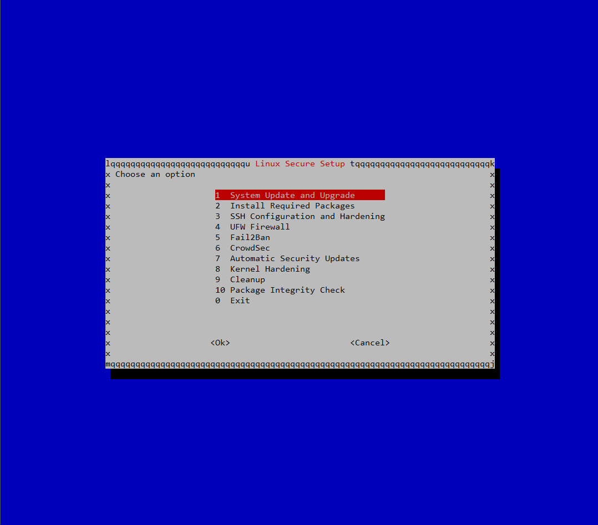

# Linux Secure Setup


Linux Secure Setup is an interactive security hardening toolkit for Debian-based Linux systems.

It provides a menu-driven interface similar to **raspi-config** and helps administrators apply common Linux server security best practices quickly and safely.

The goal is to simplify and automate the first hardening steps on a fresh Linux installation.

---

## Preview



---

## Features

- System update and upgrade
- Install required packages
- System language configuration
- Timezone configuration
- SSH configuration and hardening
- Automatic SSH socket detection and handling
- SSH port verification
- Automatic rollback if SSH configuration fails
- UFW firewall configuration
- Fail2Ban installation and configuration
- CrowdSec integration
- Automatic security updates
- Kernel hardening
- System cleanup
- Package integrity verification with `debsums`

---

## Supported Systems

Linux Secure Setup works on most Debian-based systems, including:

- Debian
- Ubuntu
- Kali Linux
- Raspberry Pi OS

---

## Installation

### Quick install

```bash
curl -sSL https://raw.githubusercontent.com/sudoAndro/linux-secure-setup/main/install.sh | sudo bash
